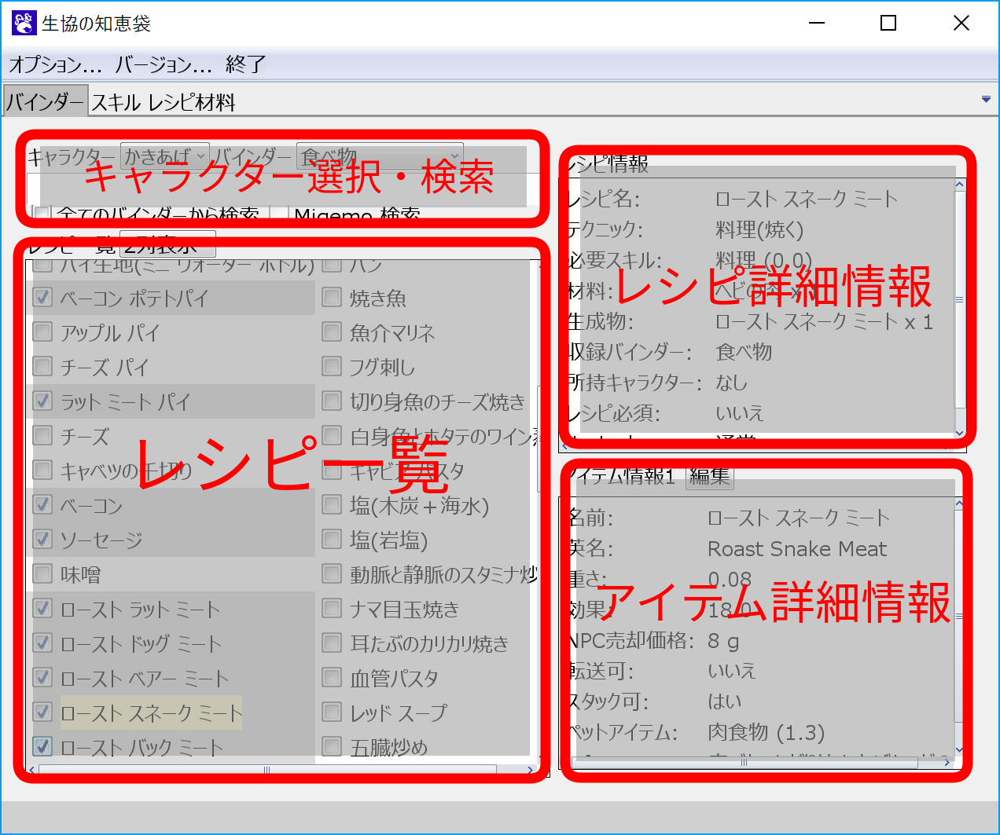
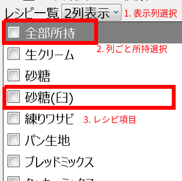
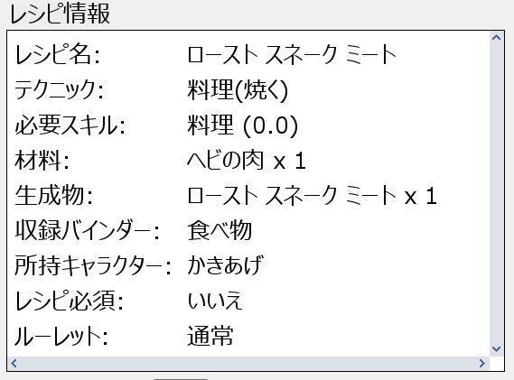
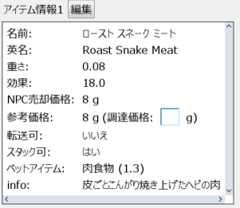

# バインダータブ
バインダータブでは、各バインダーに収録されているレシピの確認ができます。
また、登録したキャラクターごとのレシピの登録情報の管理を行うことができます。

## バインダータブの見方

### キャラクター選択・検索

1. キャラクター選択
    - レシピ一覧画面で、バインダーの所持状況を確認するキャラクターを選択します。

1. バインダー選択
    - レシピ一覧に表示するバインダーを選択します。

1. 検索窓
    - レシピ一覧に表示されるレシピを絞り込むことができます。

1. 検索オプション
    - 全てのバインダーから選択
        - チェックを入れると、全てのバインダーに含まれるレシピから検索を行います。
    - Migemo 検索
        - Migemo 検索を行います。Migemo をサポートしていない環境では、チェックボックスは選択できません。

## レシピ一覧

1. 表示列選択
    - 表示する列数を選択します。

1. 列ごと所持選択
    - レシピの所持・非所持をまとめて切り替えます。

1. レシピ項目
    - 各レシピ名には、選択しているキャラクターレシピを所持しているかを表すチェックボックスが付いています。
      レシピ名をクリックすると、レシピ詳細情報の欄に詳細が表示されます。

    また、チェックボックスやレシピ詳細情報の状態によって、以下のように背景色が変わります。

    - レシピ非所持
      
    - レシピ所持
      
    - レシピの詳細情報を表示中
      

## レシピ詳細情報
レシピの詳細情報です。
レシピ必須かどうかや、ギャンブル配置・ペナルティ配置などのルーレットの種類を確認できます。

## アイテム詳細情報
レシピから作られるアイテムの詳細情報です。
重さやNPCへの売却価格、ペットに与えた時の効果などを確認できます。
生産に使う材料や NPC の販売情報から計算された[参考価格](refprice.md)も確認できます。

- 編集ボタンから編集した項目は赤字で表示されます(削除予定)。

また、アイテムの種類によっては、以下の情報も一緒に表示されます。

- 武器
    - 攻撃力や攻撃範囲など
- 防具
    - AC や回避率など
- 食べ物・飲み物
    - バフ名やバフグループ・効果とその効果時間など
- 矢・弾
    - 射程や補正角、必要スキルなど
