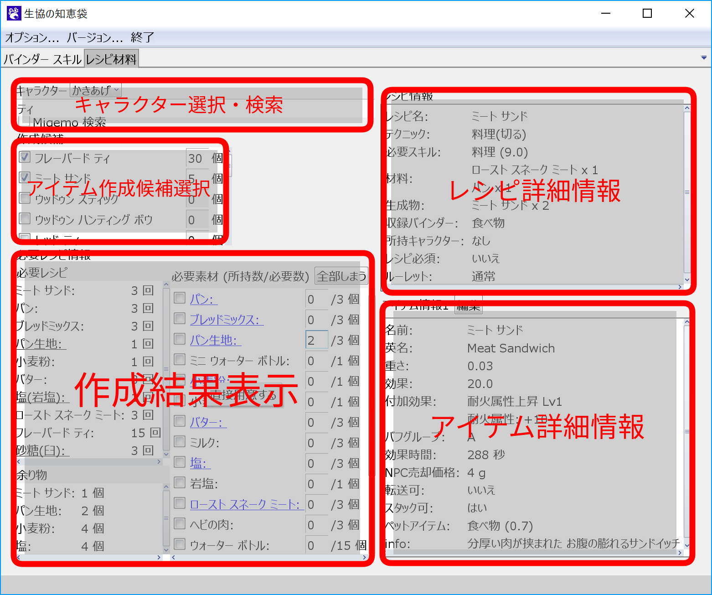
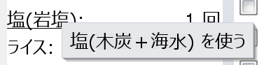

# レシピ材料タブ
レシピ材料タブでは、指定したアイテムを作成するのに必要なレシピやアイテムの総数を調べることができます。

## 大まかな使い方

1. 「キャラクター選択・検索」で作りたいアイテムを入れると、「アイテム作成候補選択」にアイテムの候補がでてきます。
1. 出てきた候補から作りたいアイテムにチェックを入れ、作成個数を入力します。
    - 作成アイテムが複数ある場合には、1 と 2 を繰り返してください。
1. 作成アイテムにチェックを入れると、「作成結果表示」に必要なレシピとコンバイン回数、必要素材と余る素材が表示されます。
    - 必要レシピを左クリックで詳細情報が表示されます。
    - 下線を右クリックで、同じアイテムを作成する別レシピを使った結果を調べられます。
1. 既に持っているアイテムを考慮して欲しい場合には、「作成結果表示」の必要素材欄に、持っているアイテムの個数を入力してください。
    - 青字は中間素材です。黒字のアイテムをコンバインしていくことで作られます。
    - 塩や麺などを購入して用意する場合は、右クリックから「自分で用意する」を選べば対応するアイテムを作成するレシピを非表示にできます。

## キャラクター選択・検索

1. キャラクター選択
    - 作成結果表示画面で、レシピの有無を確認するキャラクターを選択します。
1. 検索窓
    - アイテム名を入れると、「アイテム作成候補選択」の部分に検索結果が追加されます。

1. Migemo 検索
    - Migemo 検索を行います。Migemo をサポートしていない環境では、チェックボックスは選択できません。

## アイテム作成候補選択
検索窓にアイテム名を入れると、この部分に作成候補にできるアイテムと、作成予定のアイテムが表示されます。

- アイテム名にチェックを入れると、これまでにチェックしたアイテムを全て作成するレシピ・アイテム等が「作成結果表示」の部分に表示されます。
- 作成個数を変更すると、その個数を作成する結果を「作成結果表示」に表示します。

## 作成結果表示
作成結果では、必要なアイテムを作成するのに必要なレシピと材料一覧、作成して残る余り物を確認できます。

### 必要レシピ
作成するのに必要なレシピとコンバイン回数を確認できます。

- 下線の引いてあるレシピ名を右クリックすることで、同じアイテムを作成する別レシピを使うことができます。

- レシピ名を左クリックすると、詳細情報を見ることができます。

### 余り物
アイテムを作った時に余るアイテムを確認できます。

- アイテム名を左クリックすると、アイテムの詳細情報を確認できます。

### 必要素材
作成するのに必要な中間素材と、最初に用意する必要があるアイテムを確認できます。
また、所持しているアイテムを入力することで、そのアイテムを使うように、必要個数等を再計算して表示します。

- 青地のアイテムは中間素材です。コンバイン中に一時的に作られるアイテムなので、最初に用意する必要はありません。
- 黒字のアイテムが最初に用意する必要があるアイテムです。
- 下線が引いてあるアイテムは、右クリックメニューから、そのアイテムを直接用意する場合や、アイテムをコンバインして作る場合の必要材料を調べ直すことができます。

- アイテム名を左クリックすると、アイテムの詳細情報を確認できます。
- 書いてあるアイテムを必要数用意できたら、該当アイテムのチェックボックスをクリックすることで、残りのコンバイン回数や素材数を再計算してくれます。
- 「全部しまう」ボタンをクリックすると、所持数に書いてある個数を全て 0 にリセットします。

## レシピ詳細情報
選択したレシピの詳細情報です。
レシピ必須かどうかや、ギャンブル配置・ペナルティ配置などのルーレットの種類を確認できます。

## アイテム詳細情報
レシピから作られるアイテムの詳細情報です。
重さやNPCへの売却価格、ペットに与えた時の効果などを確認できます。
生産に使う材料や NPC の販売情報から計算された[参考価格](refprice.md)も確認できます。

- 編集ボタンから編集した項目は赤字で表示されます(削除予定)。

また、アイテムの種類によっては、以下の情報も一緒に表示されます。

- 武器
    - 攻撃力や攻撃範囲など
- 防具
    - AC や回避率など
- 食べ物・飲み物
    - バフ名やバフグループ・効果とその効果時間など
- 矢・弾
    - 射程や補正角、必要スキルなど
