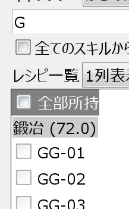
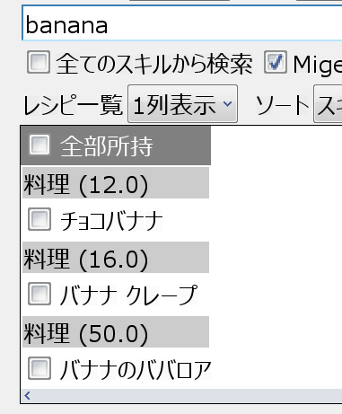

# Migemo 検索について

Migemo 検索を有効にすると、ローマ字や英語表記を利用したインクリメンタル検索ができるようになります。

## インクリメンタル検索？
インクリメンタル検索は、検索ボタンを押さなくても、入力が確定するとすぐに絞り込みを行う検索のことです。
例えばスキルタブで鍛冶スキルを選択して「G」を入力すると、すぐに GG シリーズが検索候補として表示されます。

しかし日本語入力の場合、変換が完了するまで絞り込みが行われません。
Migemo 検索を利用すると、日本語に変換しなくても、ひらがな、カタカナ、漢字や略称で検索できるようになります。

## 使い方

各タブの検索窓の下の Migemo 検索にチェックを入れて、日本語入力入力をオフにしたまま検索してみましょう！
例えばスキルタブの料理スキルを選択して「banana」と入力していくと、一文字入れていくごとに候補が絞り込まれていきます。

