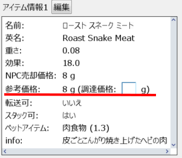

# 参考価格について

各タブのアイテム詳細情報では、NPC への販売価格とは別に、生産に使う素材の参考価格や NPC への販売価格を考慮した参考価格も確認できます。
またユーザーがアイテムの調達にかかった費用(調達価格)を入力することもできます。

- 調達価格はアイテムの調達にかけた費用で、ユーザーが自由に設定できます。
- 参考価格は、以下の要素から自動的に計算される価格です。
    - 調達価格
    - 生産レシピが存在する場合、各レシピの材料の価格や生産数など
    - NPC への売却価格
    - NPC がそのアイテムを売っている場合、そのアイテムの販売価格
    - 表示される参考価格は、全て切り上げて表示されます。

具体的には、以下の手順で価格が決められます。

- もし調達価格が設定されている場合には、それがそのまま参考価格になります。
- そうでない場合、そのアイテムがスキルで作成できるかどうかや、NPCの売却価格などによって算出方法が変わります。
    - アイテムが生産スキルで作成できる場合には、NPC売却価格とレシピから計算された価格のうち安いほうが参考価格になります。
        - ただし、NPC売却価格が 0g の場合には、レシピから計算された価格が参考価格になります。
        - 複数のレシピが存在する場合には計算結果が安いほうが、レシピから計算された価格として使われます。
        - 例えば砂糖の場合「サトウキビ => 砂糖x3 (計算価格 2.6g)」が計算価格として使われます。
    - アイテムが生産スキルでは作成できない場合には、NPCの販売価格が参考価格になります。
      - ただし、NPC が販売していないアイテムの場合には、代わりにNPC売却価格の10倍が参考価格になります。
