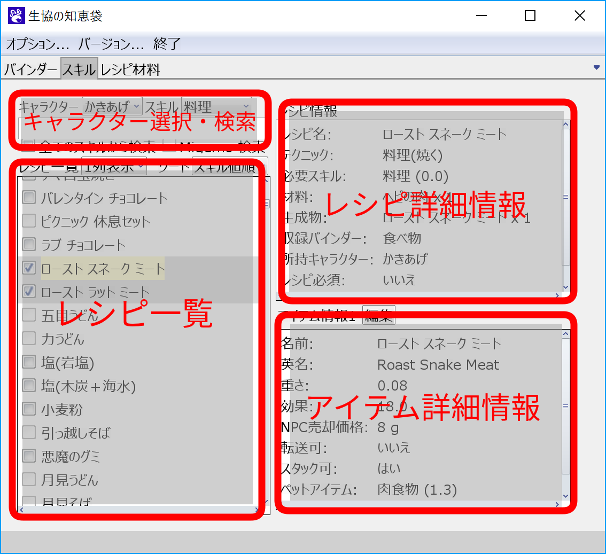
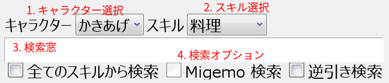

# スキルタブ
スキルタブでは、各生産スキルで作成できるアイテムのレシピの確認ができます。
また、登録したキャラクターごとのレシピの登録情報の管理を行うことができます。

## スキルタブの見方

## キャラクター選択・検索

1. キャラクター選択
    - レシピ一覧画面で、バインダーの所持状況を確認するキャラクターを選択します。

1. スキル選択
    - レシピ一覧に表示する生産スキルカテゴリを選択します。
        - カテゴリ名は、[Moe Wiki](http://moewiki.usamimi.info/index.php?MoE%20Wiki%20-%20Master%20of%20Epic)の生産スキルカテゴリに準拠しています。

1. 検索窓
    - レシピ一覧に表示されるレシピを絞り込むことができます。

1. 検索オプション
    - 全てのスキルから選択
        - チェックを入れると、全てのレシピから検索を行います。
    - Migemo 検索
        - Migemo 検索を行います。Migemo をサポートしていない環境では、チェックボックスは選択できません。
    - 逆引き検索
        - 検索窓に入れた素材を材料として使用するレシピを検索します。

## レシピ一覧

1. 表示オプション
    - 列表示: レシピを何列表示にするかを選択します。
    - ソート: レシピを表示順を選択します。
        - スキル値順: 必要スキルの昇順でソートした順番に表示します。
        - 名前順: レシピ名でソートした順に表示します。

1. 列ごと所持選択
    - レシピの所持・非所持をまとめて切り替えます。

1. 必要スキル
    - この下に並んでいるレシピに必要なスキルです。

1. レシピ項目
    - 各レシピ名には、選択しているキャラクターが対応するレシピを所持しているかを表すチェックボックスが付いています。
    - バインダーに登録できるレシピは、対応するチェックボックスをクリックすることで、レシピの所持・非所持を切り替えられます。
    - レシピ名をクリックすると、レシピ詳細情報の欄に詳細が表示されます。

    また、チェックボックスやレシピ詳細情報の状態によって、以下のように背景色が変わります。

    - レシピ非所持
      
    - レシピ所持
      
    - レシピの詳細情報を表示中
      

## レシピ詳細情報
レシピの詳細情報です。
レシピ必須かどうかや、ギャンブル配置・ペナルティ配置などのルーレットの種類を確認できます。

## アイテム詳細情報
レシピから作られるアイテムの詳細情報です。
重さやNPCへの売却価格、ペットに与えた時の効果などを確認できます。

- 編集ボタンから、埋まっていない項目を編集できます。
- 編集ボタンから編集した項目は赤字で表示されます。

また、アイテムの種類によっては、以下の情報も一緒に表示されます。

- 武器
    - 追加情報はまだ未実装
- 防具
    - 追加情報はまだ未実装
- 食べ物・飲み物
    - バフ名やバフグループ・効果とその効果時間など
- 矢・弾
    - 射程や補正角、必要スキルなど
