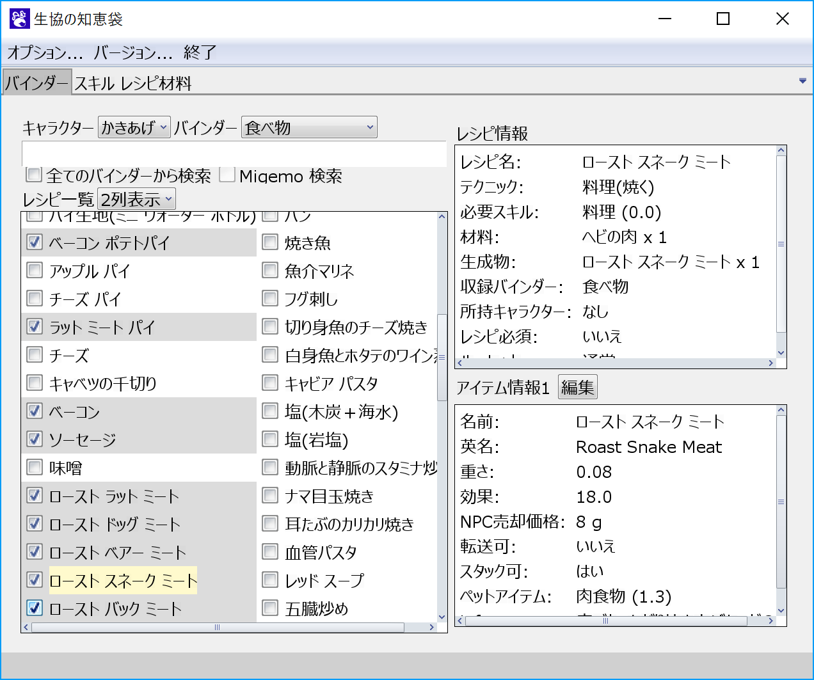
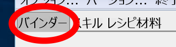
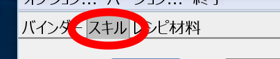
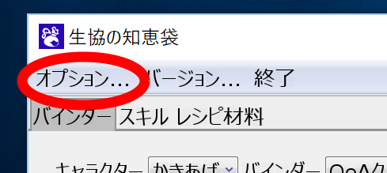
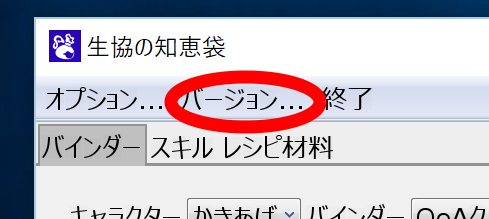
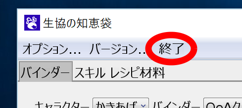

# 生協の知恵袋

生協の知恵袋は、[Master of Epic](http://moepic.com/top.php?mid=_)のバインダーやアイテム・レシピ情報を見るためのツールです。

# ダウンロード
知恵袋には以下の2種類のバージョンがあります。

- リリース版: ([ダウンロードページ](https://github.com/coop-mojo/moecoop/releases/latest) の `moecoop-*.zip`)
  - ある程度バグが取れて、安定したバージョンです。

- 生焼け版: ([64bit版](https://ci.appveyor.com/api/projects/coop-mojo/moecoop/artifacts/moecoop-trunk-64bit.zip?branch=master&job=Environment%3a%20arch%3dx64)、[32bit版](https://ci.appveyor.com/api/projects/coop-mojo/moecoop/artifacts/moecoop-trunk-32bit.zip?branch=master&job=Environment%3A%20arch%3Dx86))
  - 開発中のバージョンです。リリース版からデータや新機能が追加されていることがありますが、お腹を壊したり爆発したりするかもしれません。新しい物好きの方はこちらをどうぞ。

# おいくら万円？
- 無料です！
- 再配布できますよ！
  - コピーは合法！
  - どんどんばらまいてね！
- 開発者の方へ: 生協の知恵袋はMIT ライセンスのもとで配布されています。詳しくは[開発者向けページ](devel.md)へどうぞ！

# 使い方
- バインダーに登録されているレシピが見たい
  - [バインダータブ](binder.md)へ！
    

- 生産スキルごとのレシピを見たい
  - [スキルタブ](skill.md)へ！
    

- 複数のアイテムを素材から作成するのに必要な材料の合計数が知りたい
  - [レシピ材料タブ](material.md)へ！
    

- キャラクターの管理や Migemo 検索を使えるようにしたい
  - [オプション画面](option.md)へ！
    

- バージョン情報の確認や、公式サイトを確認したい
  - バージョン情報へ！
    

- 知恵袋を閉じたい
  - 終了ボタンをクリック！
    

- 各タブの説明にでてくる Migemo 検索って何？
  - [Migemo 検索について](migemo.md)へ！

# 開発に参加したい人向け
[開発者向けページ](devel.md)へどうぞ！

# 変更履歴
過去のバージョンや変更履歴は[こちら](https://github.com/coop-mojo/moecoop/releases)へどうぞ！
